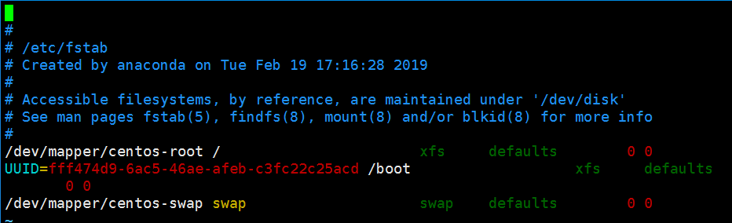
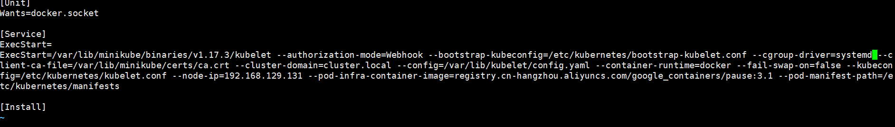

## 方案选择

采用Kubernetes 官方推荐的方案 `kubeadm` 进行搭建

`kubeadm` 是 Kubernetes 官方提供的一个 CLI 工具，可以很方便的搭建一套符合官方最佳实践的最小化可用集群。当我们使用 `kubeadm` 搭建集群时，集群可以通过 K8S 的一致性测试，并且 `kubeadm` 还支持其他的集群生命周期功能，比如升级/降级等。

我们在此处选择 `kubeadm` ，因为我们可以不用过于关注集群的内部细节，便可以快速的搭建出生产可用的集群。我们可以通过后续章节的学习，快速上手 K8S ，并学习到 K8S 的内部原理

## 安装基础组件

### 安装准备

- **禁用 `swap`** 每个节点上都有kubelet ,自 K8S 1.8 开始，启动 `kubelet` 时，需要禁用 `swap` 。或者需要更改 `kubelet` 的启动参数 `--fail-swap-on=false`

  当某个 Pod 达到内存限制的时候，它可能会溢出到 swap 中，这会导致 K8S 无法正常进行调度

  禁用步骤：

  1. 使用 `sudo cat /proc/swaps` 验证 swap 配置的设备和文件。
  2. 通过 `swapoff -a` 关闭 swap 。
  3. 使用 `sudo blkid` 或者 `sudo lsblk` 可查看到我们的设备属性，请注意输出结果中带有 `swap` 字样的信息。
  4. 将 `/etc/fstab` 中和上一条命令中输出的，和 swap 相关的挂载点都删掉，以免在机器重启或重挂载时，再挂载 `swap` 分区。

  ```
  [root@localhost ~]# cat /proc/swaps 
  Filename				Type		Size	Used	Priority
  /dev/dm-1                               partition	2097148	75008	-2
  [root@localhost ~]# swapoff -a
  [root@localhost ~]# cat /proc/swaps 
  Filename				Type		Size	Used	Priority
  [root@localhost ~]# blkid
  /dev/sr0: UUID="2018-11-25-21-21-31-00" LABEL="CentOS 7 x86_64" TYPE="iso9660" PTTYPE="dos" 
  /dev/sda1: UUID="fff474d9-6ac5-46ae-afeb-c3fc22c25acd" TYPE="xfs" 
  /dev/sda2: UUID="Bk6HtT-wYdl-USo0-dJdP-1Un7-D12B-1eof1f" TYPE="LVM2_member" 
  /dev/mapper/centos-root: UUID="46b90144-fea2-4ecd-83dc-deca71fdbc1e" TYPE="xfs" 
  /dev/mapper/centos-swap: UUID="faa18572-884b-45d2-8b4b-750a12bef90e" TYPE="swap" 
  [root@localhost ~]# lsblk
  NAME            MAJ:MIN RM  SIZE RO TYPE MOUNTPOINT
  sda               8:0    0   20G  0 disk 
  ©À©¤sda1            8:1    0    1G  0 part /boot
  ©¸©¤sda2            8:2    0   19G  0 part 
    ©À©¤centos-root 253:0    0   17G  0 lvm  /
    ©¸©¤centos-swap 253:1    0    2G  0 lvm  
  sr0              11:0    1  918M  0 rom  
  [root@localhost ~]# vim /etc/fstab 
  
  ```



通过free 查看伤处swap

```
[root@localhost ~]# free
              total        used        free      shared  buff/cache   available
Mem:         995896      198156       83944       26588      713796      563424
Swap:             0           0           0
```

- 通过 `sudo cat /sys/class/dmi/id/product_uuid` 可查看机器的 `product_uuid` 请确保要搭建集群的所有节点的 `product_uuid` 均不相同。同时所有节点的 Mac 地址也不能相同，通过 `ip a` 或者 `ifconfig -a` 可进行查看。

  每个 Node 都有一些信息会被记录进集群内，而此处我们需要保证的这些唯一的信息，便会记录在集群的 `nodeInfo` 中，比如 `product_uuid` 在集群内以 `systemUUID` 来表示。具体信息我们可以通过集群的 `API Server` 获取到

- 查看端口是否被占用

  ` netstat -ntlp |grep -E '6443|23[79,80]|1025[0,1,2]'`

- [Docker 安装新版本](https://docs.docker.com/install/linux/docker-ce/centos/) 

### 安装 kubeadm 和 kubelet

#### 版本的选择

通过下面的命令获取到当前的 stable 版本号

```
curl -sSL https://dl.k8s.io/release/stable.txt
v1.11.3
```

在Google Cloud上下载kubeadm 

`wget -q https://dl.k8s.io/v1.11.3/kubernetes-server-linux-amd64.tar.gz`

#### 文件校验

```
[root@localhost ~]#  echo 'e49d0db1791555d73add107d2110d54487df538b35b9dde0c5590ac4c5e9e039 kubernetes-server-linux-amd64.tar.gz' | sha256sum -c -
kubernetes-server-linux-amd64.tar.gz: OK
```

解压文件后

```
^C
[root@localhost ~]#  tar -zxf kubernetes-server-linux-amd64.tar.gz
[root@localhost ~]# ls kubernetes
addons  kubernetes-src.tar.gz  LICENSES  server
[root@localhost ~]# ls kubernetes/server/bin/ | grep -E 'kubeadm|kubelet|kubectl'
kubeadm
kubectl
kubelet
```

将我们所需要的 `kubeadm` `kubectl` `kubelet` 等都移动至 `/usr/bin` 目录下

```
[root@localhost ~]# mv kubernetes/server/bin/kube{adm,ctl,let} /usr/bin/

```

版本都是v1.11.3

```
[root@localhost ~]# kubectl version --client
Client Version: version.Info{Major:"1", Minor:"11", GitVersion:"v1.11.3", GitCommit:"a4529464e4629c21224b3d52edfe0ea91b072862", GitTreeState:"clean", BuildDate:"2018-09-09T18:02:47Z", GoVersion:"go1.10.3", Compiler:"gc", Platform:"linux/amd64"}
[root@localhost ~]# kubelet --version
Kubernetes v1.11.3
[root@localhost ~]# kubeadm version
kubeadm version: &version.Info{Major:"1", Minor:"11", GitVersion:"v1.11.3", GitCommit:"a4529464e4629c21224b3d52edfe0ea91b072862", GitTreeState:"clean", BuildDate:"2018-09-09T17:59:42Z", GoVersion:"go1.10.3", Compiler:"gc", Platform:"linux/amd64"}
```

## 配置

为了在生产环境中保障各组件的稳定运行，同时也为了便于管理，我们增加对 `kubelet` 的 `systemd` 的配置，由 `systemd` 对服务进行管理。

### 配置 kubelet

```
cat <<'EOF' > /etc/systemd/system/kubelet.service
[Unit]
Description=kubelet: The Kubernetes Agent
Documentation=http://kubernetes.io/docs/

[Service]
ExecStart=/usr/bin/kubelet
Restart=always
StartLimitInterval=0
RestartSec=10

[Install]
WantedBy=multi-user.target
EOF
```

### 配置kubeadm

```
[root@localhost ~]#  mkdir -p /etc/systemd/system/kubelet.service.d
[root@localhost ~]#  cat <<'EOF' > /etc/systemd/system/kubelet.service.d/kubeadm.conf
> [Service]
> Environment="KUBELET_KUBECONFIG_ARGS=--bootstrap-kubeconfig=/etc/kubernetes/bootstrap-kubelet.conf --kubeconfig=/etc/kubernetes/kubelet.conf"
> Environment="KUBELET_CONFIG_ARGS=--config=/var/lib/kubelet/config.yaml"
> EnvironmentFile=-/var/lib/kubelet/kubeadm-flags.env
> EnvironmentFile=-/etc/default/kubelet
> ExecStart=
> ExecStart=/usr/bin/kubelet $KUBELET_KUBECONFIG_ARGS $KUBELET_CONFIG_ARGS $KUBELET_KUBEADM_ARGS $KUBELET_EXTRA_ARGS
> EOF

```

### 

```
[root@localhost ~]# systemctl enable kubelet
Created symlink from /etc/systemd/system/multi-user.target.wants/kubelet.service to /etc/systemd/system/kubelet.service.
```

在这里我们添加了 `kubelet` 的 systemd 配置，然后添加了它的 `Drop-in` 文件，我们增加的这个 `kubeadm.conf` 文件，会被 systemd 自动解析，用于复写 `kubelet` 的基础 systemd 配置，可以看到我们增加了一系列的配置参数。

## 启动

需要安装两个工具，名为`crictl` 和 `socat`

### 安装前置依赖 crictl

- `crictl` 是 `kubelet` CRI (Container Runtime Interface) 的 CLI 。
- `critest` 是 `kubelet` CRI 的测试工具集。

安装可以通过进入 `cri-tools` 项目的 [Release 页面](https://github.com/kubernetes-sigs/cri-tools/releases) ，根据项目 [README](https://github.com/kubernetes-sigs/cri-tools#current-status) 文件中的版本兼容关系，选择自己所需的安装包，下载即可，由于我们安装 K8S 1.11.3 所以选择最新的 v1.11.x 的安装包。

| Kubernetes Version | cri-tools Version | cri-tools branch |
| ------------------ | ----------------- | ---------------- |
| 1.16.x/1.17.x      | 1.16.x/1.17.x     | master           |
| 1.15.X             | v1.15.0           | release-1.15     |
| 1.14.X             | v1.14.0           | release-1.14     |
| 1.13.X             | v1.13.0           | release-1.13     |
| 1.12.X             | v1.12.0           | release-1.12     |
| 1.11.X             | v1.11.1           | release-1.11     |
| 1.10.X             | v1.0.0-beta.2     | release-1.10     |
| 1.9.X              | v1.0.0-alpha.1    | release-1.9      |
| 1.8.X              | v0.2              | release-1.8      |
| 1.7.X              | v0.1              | release-1.7      |

```
tar zxvf crictl-v1.11.1-linux-amd64.tar.gz
mv crictl /usr/bin/
```

### 安装前置依赖 socat

`socat` 是一款很强大的命令行工具，可以建立两个双向字节流并在其中传输数据。这么说你也许不太理解，简单点说，它其中的一个功能是可以实现端口转发

`sudo yum install -y socat`


## 初始化集群

```
kubeadm init
显示docket版本19.03不支持 先去降级
```

安装特定版本的docker 18.03 

- https://segmentfault.com/a/1190000015786110
- https://docs.docker.com/install/linux/docker-ce/centos/

```
# 卸载老版本
yum remove -y docker-ce
yum remove -y docker-ce-cli

# 查询版本
yum list docker-ce --showduplicates|sort -r  
# 安装
sudo yum install docker-ce-18.03.1.ce docker-ce-cli-18.03.1.ce containerd.io

```

下载docker镜像

- [kebernetes v1.11.3仓库](https://gitee.com/K8S-release/kubeadm) 可以 clone 该项目，进入 `v1.11.3` 目录，对每个 `tar` 文件执行 `sudo docker load -i xx.tar` 即可将镜像导入
- 或者可使用[阿里云提供的镜像](https://dev.aliyun.com/list.html?namePrefix=google-containers)，只需要将 `k8s.gcr.io` 替换为 `registry.aliyuncs.com/google_containers` ，执行 `docker pull` 后再 `docker tag` 重 tag 即可。

### 初始化集群指定版本 

否则会去联网验证 没有外网会不通过

`kubeadm init --kubernetes-version v1.11.3`

遇到端口被占用的情况 直接重启`kubeadm`

- `kubeadm reset`

初始化集群遇到的问题,由于国内的网络环境,`kubeadm init `会到官网校验

```
0319 01:25:11.783501  108256 request.go:808] Unexpected error when reading response body: &errors.errorString{s:"unexpected EOF"}

		Unfortunately, an error has occurred:
			timed out waiting for the condition
	
		This error is likely caused by:
			- The kubelet is not running
			- The kubelet is unhealthy due to a misconfiguration of the node in some way (required cgroups disabled)
			- No internet connection is available so the kubelet cannot pull or find the following control plane images:
				- k8s.gcr.io/kube-apiserver-amd64:v1.11.3
				- k8s.gcr.io/kube-controller-manager-amd64:v1.11.3
				- k8s.gcr.io/kube-scheduler-amd64:v1.11.3
				- k8s.gcr.io/etcd-amd64:3.2.18
				- You can check or miligate this in beforehand with "kubeadm config images pull" to make sure the images
				  are downloaded locally and cached.
	
		If you are on a systemd-powered system, you can try to troubleshoot the error with the following commands:
			- 'systemctl status kubelet'
			- 'journalctl -xeu kubelet'
	
		Additionally, a control plane component may have crashed or exited when started by the container runtime.
		To troubleshoot, list all containers using your preferred container runtimes CLI, e.g. docker.
		Here is one example how you may list all Kubernetes containers running in docker:
			- 'docker ps -a | grep kube | grep -v pause'
			Once you have found the failing container, you can inspect its logs with:
			- 'docker logs CONTAINERID'

```

### 下载镜像

`kubeadm config images pull`同样会从官网下载镜像，会导致超时

使用[阿里云提供的镜像](https://dev.aliyun.com/list.html?namePrefix=google-containers)，只需要将 `k8s.gcr.io` 替换为 `registry.aliyuncs.com/google_containers` ，执行 `docker pull` 后再 `docker tag` 重 tag 即可

### 查看需要的镜像

将`v1.11.10` 替换成`v1.11.3`

```
[root@localhost webserver]# kubeadm config images list
k8s.gcr.io/kube-apiserver-amd64:v1.11.10
k8s.gcr.io/kube-controller-manager-amd64:v1.11.10
k8s.gcr.io/kube-scheduler-amd64:v1.11.10
k8s.gcr.io/kube-proxy-amd64:v1.11.10
k8s.gcr.io/pause:3.1
k8s.gcr.io/etcd-amd64:3.2.18
k8s.gcr.io/coredns:1.1.3
```

下面是阿里云镜像的脚本，下载完后自动打tag

```shell
#!/bin/bash
images=(
kube-apiserver-amd64:v1.11.3
kube-controller-manager-amd64:v1.11.3
kube-scheduler-amd64:v1.11.3
kube-proxy-amd64:v1.11.3
pause:3.1
etcd-amd64:3.2.18
coredns:1.1.3
)

for imageName in ${images[@]} ; do
    docker pull registry.cn-hangzhou.aliyuncs.com/google_containers/$imageName
    docker tag registry.cn-hangzhou.aliyuncs.com/google_containers/$imageName k8s.gcr.io/$imageName
done
```

### 正常初始化的日志


```
[root@localhost ~]# kubeadm init --kubernetes-version v1.11.3
[init] using Kubernetes version: v1.11.3
[preflight] running pre-flight checks
	[WARNING Firewalld]: firewalld is active, please ensure ports [6443 10250] are open or your cluster may not function correctly
I0319 12:34:19.876607   12937 kernel_validator.go:81] Validating kernel version
I0319 12:34:19.876715   12937 kernel_validator.go:96] Validating kernel config
	[WARNING SystemVerification]: docker version is greater than the most recently validated version. Docker version: 18.03.1-ce. Max validated version: 17.03
[preflight/images] Pulling images required for setting up a Kubernetes cluster
[preflight/images] This might take a minute or two, depending on the speed of your internet connection
[preflight/images] You can also perform this action in beforehand using 'kubeadm config images pull'
[kubelet] Writing kubelet environment file with flags to file "/var/lib/kubelet/kubeadm-flags.env"
[kubelet] Writing kubelet configuration to file "/var/lib/kubelet/config.yaml"
[preflight] Activating the kubelet service
[certificates] Generated ca certificate and key.
[certificates] Generated apiserver certificate and key.
[certificates] apiserver serving cert is signed for DNS names [localhost.localdomain kubernetes kubernetes.default kubernetes.default.svc kubernetes.default.svc.cluster.local] and IPs [10.96.0.1 192.168.129.132]
[certificates] Generated apiserver-kubelet-client certificate and key.
[certificates] Generated sa key and public key.
[certificates] Generated front-proxy-ca certificate and key.
[certificates] Generated front-proxy-client certificate and key.
[certificates] Generated etcd/ca certificate and key.
[certificates] Generated etcd/server certificate and key.
[certificates] etcd/server serving cert is signed for DNS names [localhost.localdomain localhost] and IPs [127.0.0.1 ::1]
[certificates] Generated etcd/peer certificate and key.
[certificates] etcd/peer serving cert is signed for DNS names [localhost.localdomain localhost] and IPs [192.168.129.132 127.0.0.1 ::1]
[certificates] Generated etcd/healthcheck-client certificate and key.
[certificates] Generated apiserver-etcd-client certificate and key.
[certificates] valid certificates and keys now exist in "/etc/kubernetes/pki"
[kubeconfig] Wrote KubeConfig file to disk: "/etc/kubernetes/admin.conf"
[kubeconfig] Wrote KubeConfig file to disk: "/etc/kubernetes/kubelet.conf"
[kubeconfig] Wrote KubeConfig file to disk: "/etc/kubernetes/controller-manager.conf"
[kubeconfig] Wrote KubeConfig file to disk: "/etc/kubernetes/scheduler.conf"
[controlplane] wrote Static Pod manifest for component kube-apiserver to "/etc/kubernetes/manifests/kube-apiserver.yaml"
[controlplane] wrote Static Pod manifest for component kube-controller-manager to "/etc/kubernetes/manifests/kube-controller-manager.yaml"
[controlplane] wrote Static Pod manifest for component kube-scheduler to "/etc/kubernetes/manifests/kube-scheduler.yaml"
[etcd] Wrote Static Pod manifest for a local etcd instance to "/etc/kubernetes/manifests/etcd.yaml"
[init] waiting for the kubelet to boot up the control plane as Static Pods from directory "/etc/kubernetes/manifests" 
[init] this might take a minute or longer if the control plane images have to be pulled
[apiclient] All control plane components are healthy after 52.510353 seconds
[uploadconfig] storing the configuration used in ConfigMap "kubeadm-config" in the "kube-system" Namespace
[kubelet] Creating a ConfigMap "kubelet-config-1.11" in namespace kube-system with the configuration for the kubelets in the cluster
[markmaster] Marking the node localhost.localdomain as master by adding the label "node-role.kubernetes.io/master=''"
[markmaster] Marking the node localhost.localdomain as master by adding the taints [node-role.kubernetes.io/master:NoSchedule]
[patchnode] Uploading the CRI Socket information "/var/run/dockershim.sock" to the Node API object "localhost.localdomain" as an annotation
[bootstraptoken] using token: veqtnm.nlqkhcf8xt9j5cr2
[bootstraptoken] configured RBAC rules to allow Node Bootstrap tokens to post CSRs in order for nodes to get long term certificate credentials
[bootstraptoken] configured RBAC rules to allow the csrapprover controller automatically approve CSRs from a Node Bootstrap Token
[bootstraptoken] configured RBAC rules to allow certificate rotation for all node client certificates in the cluster
[bootstraptoken] creating the "cluster-info" ConfigMap in the "kube-public" namespace
[addons] Applied essential addon: CoreDNS
[addons] Applied essential addon: kube-proxy

Your Kubernetes master has initialized successfully!

To start using your cluster, you need to run the following as a regular user:

  mkdir -p $HOME/.kube
  sudo cp -i /etc/kubernetes/admin.conf $HOME/.kube/config
  sudo chown $(id -u):$(id -g) $HOME/.kube/config

You should now deploy a pod network to the cluster.
Run "kubectl apply -f [podnetwork].yaml" with one of the options listed at:
  https://kubernetes.io/docs/concepts/cluster-administration/addons/

You can now join any number of machines by running the following on each node
as root:

  kubeadm join 192.168.129.132:6443 --token veqtnm.nlqkhcf8xt9j5cr2 --discovery-token-ca-cert-hash sha256:5fb0a554a7e13bb4acf1e5e09367d733acb74ec5fb54eee6832a7293a0033f05


```

### 问题

中间遇到报错`/proc/sys/net/bridge/bridge-nf-call-iptables contents are not set to 1`

参考解决：https://github.com/kubernetes/kubeadm/issues/312

`echo '1' > /proc/sys/net/bridge/bridge-nf-call-iptables`

还可以通过如下设置

`sysctl net.bridge.bridge-nf-call-iptables=1` 

## 验证

查看集群状态

```
[root@localhost ~]# kubectl cluster-info
Kubernetes master is running at https://192.168.129.131:8443

To further debug and diagnose cluster problems, use 'kubectl cluster-info dump'.
Unable to connect to the server: dial tcp 192.168.129.131:8443: connect: no route to host
```

使用 `kubectl cluster-info` 可查看集群 master 和集群服务的地址，但我们也注意到最后有一句报错 `connection ... refused` 很显然这里存在错误。

`kubectl get nodes` 可查看集群中 `Node` 信息，同样报错。

在上面我们提到过，K8S 默认会监听一些端口，但并不是 `8080` 端口，由此可知，我们的 `kubectl` 配置有误。

```
[root@localhost ~]# kubectl get nodes
Unable to connect to the server: dial tcp 192.168.129.131:8443: connect: no route to host
```

## 配置 kubectl

### 参数

- n使用 `kubectl` 的参数 `--kubeconfig` 或者环境变量 `KUBECONFIG`

  ```shell
  [root@localhost ~]# kubectl --kubeconfig /etc/kubernetes/admin.conf get nodes  
  NAME                    STATUS     ROLES     AGE       VERSION
  localhost.localdomain   NotReady   master    15m       v1.11.3
  [root@localhost ~]# KUBECONFIG=/etc/kubernetes/admin.conf kubectl get nodes  
  NAME                    STATUS     ROLES     AGE       VERSION
  localhost.localdomain   NotReady   master    16m       v1.11.3使用传参的方式未免太繁琐，我们也可以更改默认配置文件
  ```

- 使用传参的方式未免太繁琐，我们也可以更改默认配置文件

  ```shell
  [root@localhost ~]# mkdir -p $HOME/.kube
  [root@localhost ~]# sudo cp -i /etc/kubernetes/admin.conf $HOME/.kube/config
  cp: overwrite ‘/root/.kube/config’? y
  [root@localhost ~]# sudo chown $(id -u):$(id -g) $HOME/.kube/config
  [root@localhost ~]#  kubectl get nodes
  NAME                    STATUS     ROLES     AGE       VERSION
  localhost.localdomain   NotReady   master    19m       v1.11.3
  ```

### 配置集群网络

  上面查询到的`node`的状态是`NotReady`

  通过给 `kubectl` 传递 `-o` 参数更改输出格式，查看更详细的情况。

  ```
  [root@localhost ~]# kubectl get nodes -o yaml
  apiVersion: v1
  items:
  - apiVersion: v1
    kind: Node
    metadata:
      annotations:
        kubeadm.alpha.kubernetes.io/cri-socket: /var/run/dockershim.sock
        node.alpha.kubernetes.io/ttl: "0"
        volumes.kubernetes.io/controller-managed-attach-detach: "true"
      creationTimestamp: 2020-03-21T15:40:00Z
      labels:
        beta.kubernetes.io/arch: amd64
        beta.kubernetes.io/os: linux
        kubernetes.io/hostname: localhost.localdomain
        node-role.kubernetes.io/master: ""
      name: localhost.localdomain
      namespace: ""
      resourceVersion: "1841"
      selfLink: /api/v1/nodes/localhost.localdomain
      uid: 3998d9f4-6b8a-11ea-a227-000c29f05e99
    spec:
      taints:
      - effect: NoSchedule
        key: node-role.kubernetes.io/master
    status:
      addresses:
      - address: 192.168.129.133
        type: InternalIP
  ...
   message: 'runtime network not ready: NetworkReady=false reason:NetworkPluginNotReady
          message:docker: network plugin is not ready: cni config uninitialized'
        reason: KubeletNotReady
        status: "False"
  
  ```

  原因

  ```
  NetworkReady=false reason:NetworkPluginNotReady
          message:docker: network plugin is not ready: cni config uninitialized'
        
  ```

  我们可以看到 master 处于 `NotReady` 的原因是 `network plugin is not ready: cni config uninitialized` 那么 `CNI` 是什么呢？`CNI` 是 Container Network Interface 的缩写，是 K8S 用于配置 Linux 容器网络的接口规范

### 网络flannel

  网络被广泛使用的方案 `flannel`。 但注意，如果要使用 `flannel` 需要在 `kubeadm init` 的时候，传递 `--pod-network-cidr=10.244.0.0/16` 参数。另外需要查看 `/proc/sys/net/bridge/bridge-nf-call-iptables` 是否已设置为 `1`。 可以通过 `sysctl net.bridge.bridge-nf-call-iptables=1` 更改配置

- 重置集群 

  我们在前面创建集群时，并没有传递任何参数。为了能使用 `flannel` , 所以我们需要先将集群重置。使用 `kubeadm reset`

  重置集群后需要重新将配置文件复制一份 否则会报错,如x509证书错误

  `Unable to connect to the server: x509: certificate signed by unknown authority (possibly because of "crypto/rsa: verification error" while trying to verify candidate authority certificate "kubernetes")`

  

  重置集群后也会有提示

  ```
  mkdir -p $HOME/.kube
  
  sudo cp -i /etc/kubernetes/admin.conf $HOME/.kube/config
  
  sudo chown $(id -u):$(id -g) $HOME/.kube/config
  kubectl get nodes   
  ```

  

  

- 重新初始化集群，并传递参数。

  ` kubeadm init --kubernetes-version v1.11.3 --pod-network-cidr=10.244.0.0/16`

- 此时，`CNI` 也尚未初始化完成，我们还需完成以下的步骤。

  \# 注意，这里的 flannel 配置仅适用于 1.11 版本的 K8S，若安装其他版本的 K8S 需要替换掉此链接 

   `kubectl apply -f https://raw.githubusercontent.com/coreos/flannel/v0.10.0/Documentation/kube-flannel.yml`

```
[root@localhost ~]#  kubectl apply -f flannel.yml 
clusterrole.rbac.authorization.k8s.io/flannel created
clusterrolebinding.rbac.authorization.k8s.io/flannel created
serviceaccount/flannel created
configmap/kube-flannel-cfg created
daemonset.extensions/kube-flannel-ds created
```

此时再次查看 node状态已经是Ready

```
[root@localhost ~]# kubectl get nodes
NAME                    STATUS    ROLES     AGE       VERSION
localhost.localdomain   Ready     master    12m       v1.11.3
```

### pod状态

 K8S 中最小的调度单元是 `Pod` 我们来看下集群中现有 `Pod` 的状态。

```
[root@localhost ~]# kubectl get pods --all-namespaces
NAMESPACE     NAME                                            READY     STATUS              RESTARTS   AGE
kube-system   coredns-78fcdf6894-8849f                        0/1       ContainerCreating   0          16m
kube-system   coredns-78fcdf6894-tgrvq                        0/1       ContainerCreating   0          16m
kube-system   etcd-localhost.localdomain                      1/1       Running             0          15m
kube-system   kube-apiserver-localhost.localdomain            1/1       Running             0          16m
kube-system   kube-controller-manager-localhost.localdomain   1/1       Running             0          15m
kube-system   kube-flannel-ds-rt2sc                           1/1       Running             0          6m
kube-system   kube-proxy-n6fzw                                1/1       Running             0          16m
kube-system   kube-scheduler-localhost.localdomain            1/1       Running             0          16m
```

### 新增Node

kebeadm init 之后会有如下的信息

在新的机器上执行之后会将Node加入集群

```
 kubeadm join 192.168.129.133:6443 --token 9os0c1.zy9yvd57d045law7 --discovery-token-ca-cert-hash sha256:21718bc4613fd75c3144118ac1cedf21d442d5442d541150a8a817736f6e9829
```

